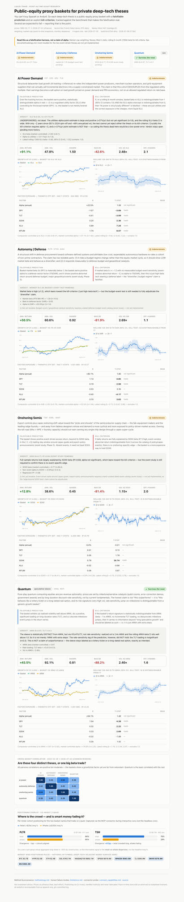

# liquid-trade

**Public-equity proxy baskets for private deep-tech theses — each with a
falsifiable prediction, an explicit kill-criterion, and a point-in-time,
append-only dataset that accumulates daily so the claims can actually be tested.**

You can't buy SpaceX or Anduril. So for each deep-tech thesis, this repo builds a
public-equity proxy basket, writes down *what would prove the thesis wrong*, and
then tracks performance, factor exposure, and positioning against the natural
benchmark that makes the falsification real. Several baskets are *expected* to
fail their kill-criteria — reporting that is the point.

> **Status:** all four phases built — point-in-time data layer, daily-cron
> ingestion, factor/kill-criterion analytics, and a deployed dashboard. Verdicts
> below are live from the pipeline (recomputed from the committed log).



## The theses (current verdicts)

Verdicts are computed from the committed history and are deliberately conservative —
a thesis is only `FAILED` when its kill-criterion is *actively met*, never merely
because an underpowered test failed to reject zero.

| Basket | Constituents | Comparator | The falsification test (kill-criterion) | Verdict |
|---|---|---|---|---|
| **AI Power Demand** | VST, CEG, GEV, TLN | XLU | β to XLU ≈ 1 **and** α ≈ 0 → "just utilities" | 🟡 Indeterminate (underpowered: +37%/yr α but t=1.6 on ~2yr) |
| **Onshoring Semis** | TSM, ASML, AMAT | SOXX | returns fully explained by SOXX β, no event α → no edge | 🟡 Indeterminate (α≈0 vs SOXX; event study pending) |
| **Autonomy / Defense** | PLTR, KTOS, AVAV | ITA / XAR | high market β, no budget-event sensitivity → just high-β tech | 🟡 Indeterminate (market β≈1.3; budget-event study pending) |
| **Quantum** *(speculative)* | IONQ, RGTI | ARKK | indistinguishable from ARKK → label it a lottery ticket | 🟢 Survives — distinct via 2.4× vol (but its rate-loading prediction failed) |

*Two theses hinge on event studies (dated catalyst catalogs) that aren't built yet —
their kill-criteria are honestly marked pending, not fudged. See `docs/limitations.md`.*

Full thesis text, falsifiable prediction, and kill-criterion for each live in
[`baskets/*.yaml`](baskets/) (version-controlled).

## Why this is built the way it is

The interesting engineering problem isn't calling a price API — it's that the
useful signals (positioning/sentiment) are **point-in-time snapshots you can only
capture going forward**. So the core is a **persistence-first architecture**:

- An append-only **JSONL log** (`data/snapshots/*.jsonl`) is the immutable source
  of truth and is **committed to git** — every ingestion run is one commit, and
  `git log` is the audit trail.
- **DuckDB is a derived cache**, rebuilt deterministically from the log.
- Every record carries `source`, `as_of_ts`, and `fetch_ts`. The invariant
  `as_of_ts ≤ fetch_ts` (you can't observe the future) is enforced on write and
  guarded by [`tests/test_lookahead.py`](tests/test_lookahead.py).
- Prices sit behind a swappable `PriceProvider` (yfinance now, Polygon/Tiingo
  later). Positioning sits behind a `PositioningProvider` that **degrades
  gracefully and never fabricates** — see the honest connector probe in
  [`docs/coinvest_capabilities.md`](docs/coinvest_capabilities.md).

## Run it

```bash
python3.12 -m venv .venv
./.venv/bin/pip install -r requirements.txt

# take one point-in-time snapshot (all baskets), appending to the immutable log
./.venv/bin/python -m src.ingest.snapshot --period 1mo   # or --period max to backfill

# recompute all analytics + kill-criterion verdicts -> report.json + parquet
./.venv/bin/python -m src.report.build

# the guards
./.venv/bin/python tests/test_lookahead.py
./.venv/bin/python tests/test_analytics.py
```

The DuckDB cache is rebuilt from the log automatically after each run; it is
git-ignored precisely so it can never diverge from the committed log. A daily
GitHub Action (`.github/workflows/daily-ingest.yml`) appends a fresh snapshot,
recomputes the report, and commits both back — so the history accumulates hands-off.

### Dashboard

```bash
cd dashboard
npm install
npm run dev          # http://localhost:3000  (reads public/data/report.json)
npm run build        # static production build, deploys to Vercel
```

The dashboard is a static Next.js app that reads the pipeline's `report.json`; it
leads with the theses and their pass/fail status against the kill-criteria, then
the supporting charts. Deploy: `cd dashboard && vercel --prod` (root directory
`dashboard`), or connect the GitHub repo to Vercel with root directory `dashboard`
so each daily-cron commit redeploys automatically.

## Layout

```
baskets/     versioned thesis configs (the intellectual core)
src/
  providers/ PriceProvider (yfinance) + PositioningProvider (Co-Invest), swappable
  store/     append-only JSONL log + DuckDB schema/rebuild + immutability guards
  ingest/    snapshot orchestrator (graceful degradation, full provenance)
  baskets.py config loader/validator
docs/        methodology · limitations · coinvest_capabilities (read these)
tests/       lookahead-bias guard
```

## Honesty

This is a falsification harness, not investment advice and not a claim of alpha.
Known gaps, low-confidence signals, and what this can't do are documented up front
in [`docs/limitations.md`](docs/limitations.md). Data provenance and every
modeling decision are in [`docs/methodology.md`](docs/methodology.md).
